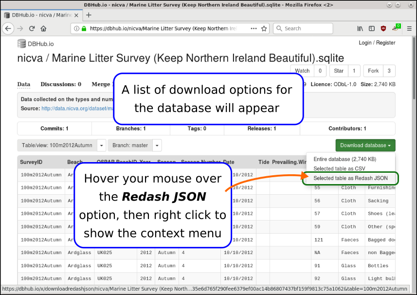
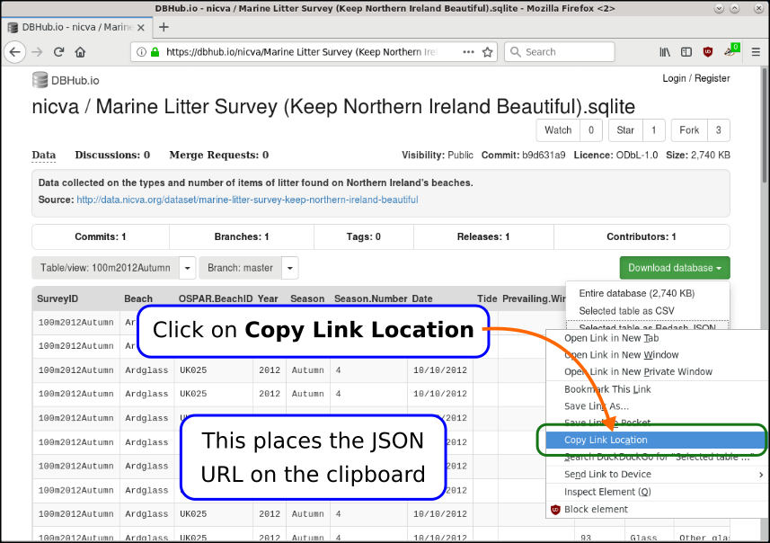
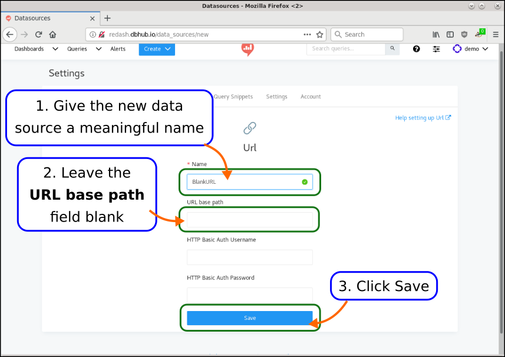
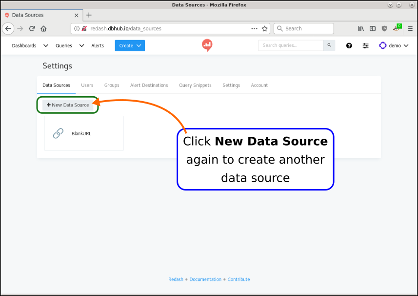
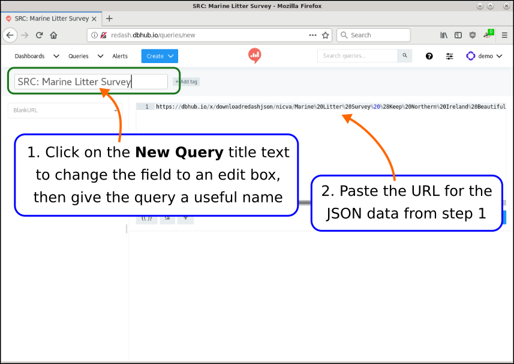
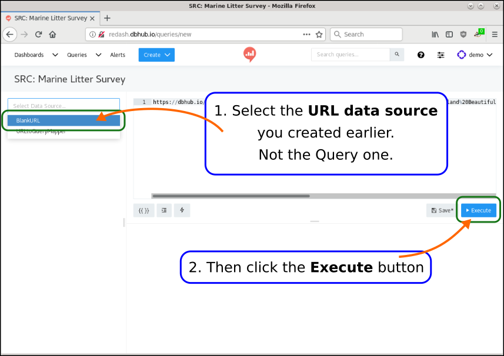
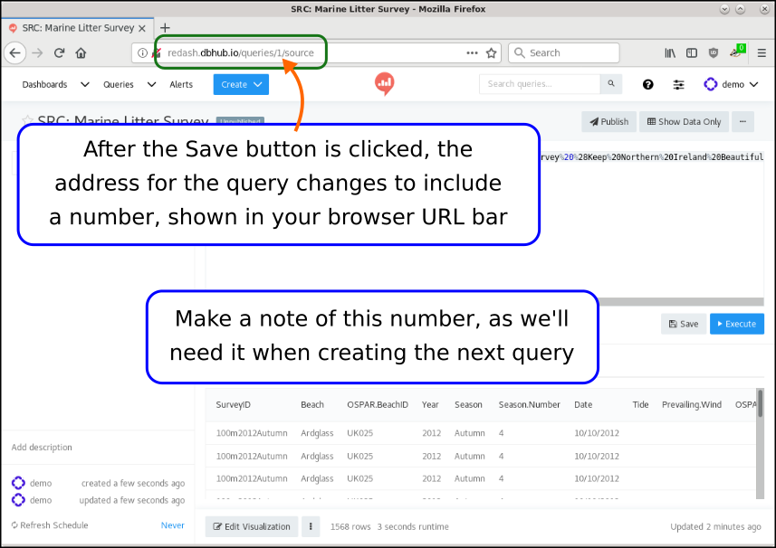
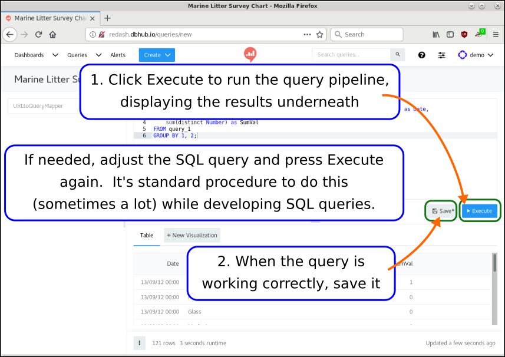

# Get the URL of your JSON data

For this example, we're using the [NICVA Marine Litter Survey](https://dbhub.io/nicva/Marine%20Litter%20Survey%20(Keep%20Northern%20Ireland%20Beautiful).sqlite) database.

```{r, echo = FALSE, fig.align='center', out.width='90%'}

```

```{r, echo = FALSE, fig.align='center', out.width='90%'}

```

```{r, echo = FALSE, fig.align='center', out.width='90%'}

```

# In Redash, open Data Sources Settings

```{r, echo = FALSE, fig.align='center', out.width='90%'}
knitr::include_graphics("images/030_redash_welcome_page1.png")
```

```{r, echo = FALSE, fig.align='center', out.width='90%'}
knitr::include_graphics("images/040_redash_welcome_page2.png")
```

# Create a new Data Source

```{r, echo = FALSE, fig.align='center', out.width='90%'}

```

```{r, echo = FALSE, fig.align='center', out.width='90%'}
knitr::include_graphics("images/070_redash_new_data_source2.png")
```

# Fill out the details for the data source

```{r, echo = FALSE, fig.align='center', out.width='90%'}

```

```{r, echo = FALSE, fig.align='center', out.width='90%'}
knitr::include_graphics("images/090_redash_new_data_source_url2.png")
```

# Create another new Data Source

```{r, echo = FALSE, fig.align='center', out.width='90%'}

```

```{r, echo = FALSE, fig.align='center', out.width='90%'}

```

```{r, echo = FALSE, fig.align='center', out.width='90%'}
knitr::include_graphics("images/110_redash_new_data_source_query_mapper1.png")
```

```{r, echo = FALSE, fig.align='center', out.width='90%'}
knitr::include_graphics("images/120_redash_new_data_source_query_mapper2.png")
```

# Create the Source query

```{r, echo = FALSE, fig.align='center', out.width='90%'}
knitr::include_graphics("images/125_redash_new_query_select_data_source0.png")
```

```{r, echo = FALSE, fig.align='center', out.width='90%'}

```

```{r, echo = FALSE, fig.align='center', out.width='90%'}

```

```{r, echo = FALSE, fig.align='center', out.width='90%'}

```

# Create the visualisation query

```{r, echo = FALSE, fig.align='center', out.width='90%'}
knitr::include_graphics("images/160_redash_new_query_select_data_source4.png")
```

```{r, echo = FALSE, fig.align='center', out.width='90%'}
knitr::include_graphics("images/170_redash_new_query2_select_data_source1.png")
```

```{r, echo = FALSE, fig.align='center', out.width='90%'}
knitr::include_graphics("images/180_redash_new_query2_select_data_source2.png")
```

```{r, echo = FALSE, fig.align='center', out.width='90%'}
knitr::include_graphics("images/190_redash_new_query2_select_data_source3.png")
```

The SQL in the above screenshot is:

```
SELECT
    substr(Date, 7, 4) || '-' || substr(Date, 4, 2) || '-' || substr(Date, 1, 2) as Date,
    Category,
    sum(distinct Number) as SumVal
FROM query_1
GROUP BY 1, 2;
```

Take special care of the FROM clause: `FROM query_1`.  The number `1` in `query_1`
is the query # you saved before.

So, if the number of the query you saved in the previous step was 234, your SQL
query will need a `FROM` clause of `FROM query_234`.

```{r, echo = FALSE, fig.align='center', out.width='90%'}

```

```{r, echo = FALSE, fig.align='center', out.width='90%'}

```
