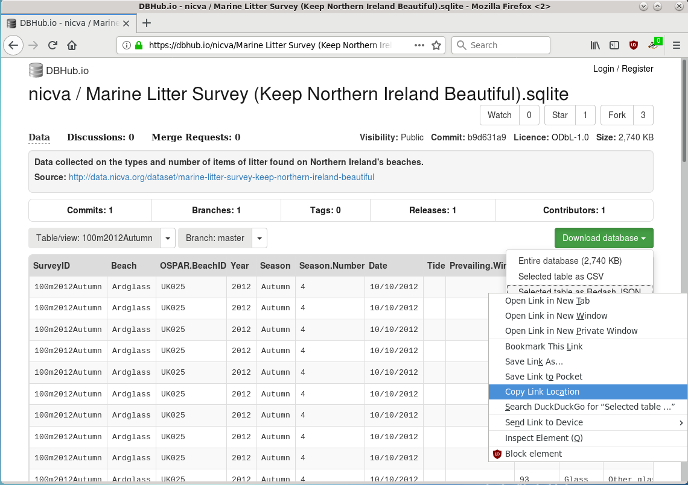

# Get the URL of your JSON data

```{r, echo = FALSE, fig.align='center', out.width='90%'}

```


```{r, echo = FALSE, fig.align='center', out.width='90%'}

```


```{r, echo = FALSE, fig.align='center', out.width='90%'}

```


```{r, echo = FALSE, fig.align='center', out.width='90%'}

```


```{r, echo = FALSE, fig.align='center', out.width='90%'}

```


```{r, echo = FALSE, fig.align='center', out.width='90%'}

```


```{r, echo = FALSE, fig.align='center', out.width='90%'}

```


```{r, echo = FALSE, fig.align='center', out.width='90%'}

```


```{r, echo = FALSE, fig.align='center', out.width='90%'}
knitr::include_graphics("raw_screenshots/redash_new_data_source2.png")
```


```{r, echo = FALSE, fig.align='center', out.width='90%'}

```


```{r, echo = FALSE, fig.align='center', out.width='90%'}

```


```{r, echo = FALSE, fig.align='center', out.width='90%'}

```


```{r, echo = FALSE, fig.align='center', out.width='90%'}

```


```{r, echo = FALSE, fig.align='center', out.width='90%'}

```


```{r, echo = FALSE, fig.align='center', out.width='90%'}

```


```{r, echo = FALSE, fig.align='center', out.width='90%'}

```


```{r, echo = FALSE, fig.align='center', out.width='90%'}

```


```{r, echo = FALSE, fig.align='center', out.width='90%'}

```


```{r, echo = FALSE, fig.align='center', out.width='90%'}

```


```{r, echo = FALSE, fig.align='center', out.width='90%'}

```


```{r, echo = FALSE, fig.align='center', out.width='90%'}

```


```{r, echo = FALSE, fig.align='center', out.width='90%'}

```


```{r, echo = FALSE, fig.align='center', out.width='90%'}

```
